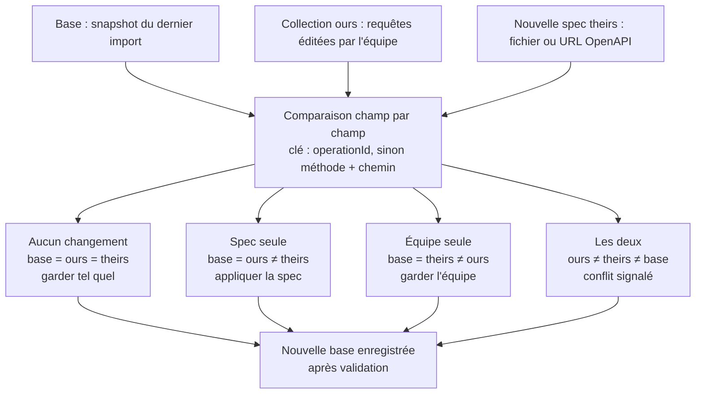
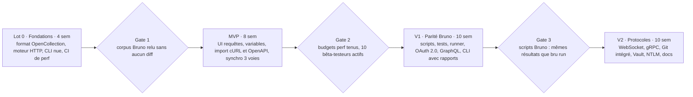

# Cahier des charges — Client API desktop offline-first (parité Bruno)

29 septembre 2026 · DICKO Issa Hamadou

## 1. Contexte et objectif

L'objectif est de livrer un client API desktop, offline-first et Git-friendly, qui atteint la parité fonctionnelle avec Bruno sur le cœur d'usage, puis le dépasse sur deux points : la performance native et la synchronisation OpenAPI non destructive.

Bruno a imposé un modèle simple : les collections sont des fichiers texte dans un dossier, versionnés avec Git, sans compte ni cloud. On reprend ce modèle tel quel. On s'en démarque par une stack Rust + Tauri plutôt qu'Electron, et par un import OpenAPI qui fusionne au lieu d'écraser.

**Nom de code** : à définir.

### Périmètre

- Application desktop Windows, macOS et Linux.
- Requêtes REST, GraphQL, puis WebSocket et gRPC.
- Collections, dossiers, environnements, variables, secrets.
- Authentification, scripts pré et post requête, assertions, tests.
- Runner de collection et CLI pour la CI.
- Import Bruno, Postman, Insomnia, OpenAPI, cURL. Export Bruno, Postman, OpenAPI.
- Synchronisation OpenAPI continue avec fusion à 3 voies.

### Hors périmètre

- Compte utilisateur, cloud, synchronisation propriétaire : la synchro passe par Git.
- Collaboration temps réel.
- Mock server et monitoring planifié (candidats V3).
- Version web ou mobile.

## 2. Principes directeurs

Cinq règles non négociables. Toute fonctionnalité qui en viole une est rejetée ou reportée.

1. **Offline-first** : toutes les fonctions marchent sans réseau, hors l'envoi de la requête elle-même. Aucun appel sortant non demandé par l'utilisateur, aucune télémétrie par défaut.
2. **Le disque est la source de vérité** : une collection est un dossier, une requête est un fichier. Pas de base propriétaire qui détient la donnée. Un index local sert uniquement de cache et se reconstruit depuis les fichiers.
3. **Git-friendly** : format texte lisible, ordre des clés stable, une requête par fichier, pas de champs volatils (horodatage, UUID régénérés) qui polluent les diffs.
4. **Rapide par défaut** : les traitements lourds (HTTP, parsing, diff, recherche) tournent en Rust, jamais dans le webview. Budgets de performance chiffrés en section 7.
5. **Non destructif** : aucune opération automatique (import, synchro OpenAPI, migration de format) n'écrase une donnée saisie par l'utilisateur. En cas de doute, conflit signalé, jamais d'écrasement silencieux.

## 3. Stack technique

Rust pour tout le moteur, Tauri 2 pour la fenêtre, un front léger pour l'affichage. Le moteur est une bibliothèque partagée entre l'application et la CLI, pour garantir que `run` en CI donne exactement le même résultat que dans l'app.

### Découpage en crates (workspace Cargo)

| Crate | Rôle |
| --- | --- |
| `core` | Modèle de données, lecture et écriture du format fichier, résolution des variables |
| `engine` | Exécution HTTP, GraphQL, WebSocket, gRPC, mesure des timings |
| `script` | Sandbox JavaScript pour scripts, assertions et tests |
| `sync` | Import, export, parsing OpenAPI, fusion à 3 voies |
| `cli` | Binaire en ligne de commande pour la CI |
| `app` | Application Tauri : commandes IPC, fenêtre, état UI |

### Choix techniques

| Besoin | Choix | Raison |
| --- | --- | --- |
| Fenêtre desktop | Tauri 2 | Binaire léger, webview système, IPC typé |
| Front | Angular zoneless + signals (alternative : SolidJS) | Expertise existante, réactivité fine sans zone.js |
| Éditeur de code | CodeMirror 6 | Bien plus léger que Monaco, gère les gros documents |
| Runtime async | tokio | Standard de fait |
| Client HTTP | hyper + rustls | Accès bas niveau pour les timings DNS, TCP, TLS, TTFB |
| JavaScript embarqué | rquickjs (QuickJS) | Sandbox isolée, démarrage en millisecondes, pas de Node requis |
| OpenAPI | `oas3` (3.1) et `openapiv3` (3.0) | Couvre les deux versions courantes |
| Sérialisation fichier | serde + crate YAML maintenue | `serde_yaml` est archivé, à remplacer |
| Index et recherche | SQLite FTS5 via `rusqlite` | Recherche plein texte instantanée, reconstructible |
| Surveillance disque | `notify` | Recharge à chaud quand Git ou un éditeur externe modifie un fichier |
| Git | `gix` (gitoxide) | Pur Rust, pas de dépendance libgit2 |
| Secrets | `keyring` | Trousseau natif de l'OS |
| WebSocket / gRPC | `tokio-tungstenite` / `tonic` + `prost-reflect` | gRPC dynamique à partir des `.proto` ou de la réflexion serveur |
| CLI | `clap` | Standard de fait |

## 4. Format de stockage

Le format natif est **OpenCollection YAML**, la spécification ouverte que Bruno utilise par défaut depuis la v3. Une collection créée avec Bruno s'ouvre donc directement dans notre client, et inversement, sans import ni conversion. C'est le levier le plus fort pour « s'approcher au max de Bruno » : même format, mêmes fichiers, même dépôt Git.

L'ancien format `.bru` est supporté en lecture, avec conversion proposée vers YAML. Bruno le garde aussi pour la rétrocompatibilité.

### Arborescence

```
ma-collection/
├── opencollection.yml
├── environments/
│   ├── dev.yml
│   └── prod.yml
├── auth/
│   └── login.yml
├── users/
│   ├── get-user.yml
│   └── create-user.yml
├── .env
└── .oc-sync/
    └── openapi/
        ├── source.yml
        └── spec.json
```

### Règles

- Tout ce qui est standard OpenCollection reste strictement conforme à la spec. On ne pose aucun champ propriétaire dans les fichiers de requête, sinon Bruno les perdrait à la réécriture.
- Nos métadonnées propres (copie brute de la spec qui sert de base à la synchro OpenAPI, source de la spec, correspondance opération → fichier) vivent dans `.oc-sync/`, faites pour être versionnées : c'est ce qui rend la base partageable dans l'équipe. Format détaillé : `synchro-openapi.md`.
- Les secrets ne sont jamais écrits dans les fichiers : trousseau de l'OS, ou `.env` local ignoré par Git.
- Écriture atomique (fichier temporaire puis renommage) pour ne jamais laisser un fichier à moitié écrit.
- Ordre des clés et indentation déterministes : sauvegarder sans modification ne produit aucun diff.

Sources : [Bruno — OpenCollection YAML](https://docs.usebruno.com/opencollection-yaml/overview), [Bruno — tutoriel officiel v4](https://blog.usebruno.com/bruno-tutorial).

## 5. Exigences fonctionnelles

Chaque exigence a un identifiant stable pour le suivi et les tests d'acceptation. La priorité de livraison est donnée en section 8.

| ID | Module | Exigence |
| --- | --- | --- |
| EF-REQ-01 | Requête HTTP | Toutes les méthodes HTTP, URL avec variables `{{var}}`, paramètres query et path éditables en tableau, synchronisés avec l'URL |
| EF-REQ-02 | Requête HTTP | Body : JSON, XML, texte, form-urlencoded, multipart (fichiers), binaire |
| EF-REQ-03 | Requête HTTP | Onglets multiples, sauvegarde Ctrl+S, indicateur de modification, annulation d'une requête en cours |
| EF-REQ-04 | Requête HTTP | Réglages : timeout, redirections, vérification TLS, proxy système ou personnalisé, certificats client (mTLS), CA personnalisée |
| EF-RES-01 | Réponse | Statut, durée, taille, headers, cookies, body formaté avec coloration |
| EF-RES-02 | Réponse | Timeline détaillée : DNS, connexion TCP, TLS, TTFB, téléchargement |
| EF-RES-03 | Réponse | Filtre JSONPath sur le body, aperçu HTML et image, enregistrement du body dans un fichier |
| EF-COL-01 | Collections | Arborescence de dossiers, glisser-déposer, ordre persisté, clonage de requête et de dossier |
| EF-COL-02 | Collections | Plusieurs collections ouvertes, recherche plein texte sur nom, URL et body |
| EF-COL-03 | Collections | Rechargement à chaud quand un fichier change sur disque (pull Git, éditeur externe) |
| EF-COL-04 | Collections | Partir de zéro : créer une collection dans un dossier vide ; créer, renommer, dupliquer et supprimer (vers la corbeille du système) requêtes et dossiers, avec des fichiers identiques à ceux qu'écrit Bruno |
| EF-VAR-01 | Variables | Portées globale, collection, environnement, dossier, requête, runtime, avec précédence documentée et identique à Bruno |
| EF-VAR-02 | Variables | Variables typées (nombre, booléen, objet) et variables dynamiques (UUID, timestamp, aléatoires) |
| EF-VAR-03 | Variables | Secrets hors fichiers : trousseau OS, `.env` local via `process.env`, HashiCorp Vault en V2 |
| EF-AUT-01 | Auth | Basic, Bearer, API Key, Digest, AWS SigV4 |
| EF-AUT-02 | Auth | OAuth 2.0 : authorization code + PKCE, client credentials, password, refresh automatique du token |
| EF-AUT-03 | Auth | NTLM, OAuth 1.0 |
| EF-AUT-04 | Auth | Héritage de l'auth depuis la collection ou le dossier |
| EF-SCR-01 | Scripts | Scripts pré-requête et post-réponse aux niveaux collection, dossier et requête, dans le même ordre d'exécution que Bruno |
| EF-SCR-02 | Scripts | API compatible Bruno (`bru`, `req`, `res`) pour qu'un script Bruno tourne sans modification |
| EF-SCR-03 | Scripts | Bibliothèques intégrées (crypto, base64, uuid), `bru.sendRequest`, sandbox sans accès disque ni réseau hors API |
| EF-TST-01 | Tests | Tests JavaScript style Chai (`test`, `expect`), résultats affichés à côté de la réponse |
| EF-TST-02 | Tests | Assertions déclaratives sans code (`res.status eq 200`) |
| EF-RUN-01 | Runner | Exécution d'une collection ou d'un dossier, délai entre requêtes, arrêt au premier échec optionnel |
| EF-RUN-02 | Runner | Itérations pilotées par données CSV ou JSON, contrôle du flux (`setNextRequest`) |
| EF-CLI-01 | CLI | `run` sur collection, dossier ou requête, `--env`, `--env-var`, code de sortie non nul en cas d'échec |
| EF-CLI-02 | CLI | Rapports JUnit, HTML, JSON ; binaire unique sans Node ; image Docker |
| EF-IMP-01 | Import | cURL (collage détecté automatiquement), Postman v2.1, Insomnia, collections `.bru` |
| EF-IMP-02 | Import | OpenAPI 3.0, 3.1 et Swagger 2.0, en fichier ou URL |
| EF-IMP-03 | Export | Postman v2.1, OpenAPI, cURL |
| EF-GEN-01 | Codegen | Génération de code : cURL, JS fetch, Python, Go, Java, Kotlin, Dart, PHP, C# |
| EF-DOC-01 | Docs | Documentation Markdown par requête, dossier et collection |
| EF-GQL-01 | GraphQL | Requêtes et mutations, variables, introspection, autocomplétion sur le schéma |
| EF-WS-01 | WebSocket | Connexion, envoi et réception de messages, historique de la session |
| EF-GRPC-01 | gRPC | Unaire et streaming, chargement de `.proto` ou réflexion serveur |
| EF-GIT-01 | Git | Statut, diff, commit, pull et push depuis l'app (fonction payante chez Bruno, gratuite ici) |
| EF-UX-01 | Interface | Thèmes clair et sombre, raccourcis clavier, palette de commandes, interface français et anglais |
| EF-UX-02 | Interface | Historique local des requêtes envoyées, gestionnaire de cookies |
| EF-UX-03 | Interface | Réglages d'apparence : famille et taille des polices de l'interface, de l'éditeur de requête et du résultat (préréglages hors ligne ou police installée), appliquées en direct et conservées localement |
| EF-AI-01 | IA | Assistant optionnel (clé fournie par l'utilisateur) pour générer tests et scripts, désactivé par défaut |

## 6. Synchronisation OpenAPI non destructive

La synchro compare, champ par champ, la spec importée la dernière fois (base), la collection actuelle (ours) et la nouvelle spec (theirs). Seul un champ modifié à la fois par l'équipe et par la spec devient un conflit ; tout le reste se règle sans intervention et sans écraser le travail de l'équipe.



Un conflit n'est jamais tranché automatiquement : la valeur de l'équipe reste en place jusqu'à arbitrage.

### Propriété des champs

| Champ | Propriétaire | Traitement à la synchro |
| --- | --- | --- |
| Méthode, chemin | Spec | Fusion à 3 voies |
| Paramètres path et query (nom, type, requis) | Spec | Fusion ; les valeurs saisies par l'équipe sont conservées |
| Schéma et exemple de body | Spec | Fusion ; un body édité par l'équipe compte comme « ours » |
| Headers déclarés dans la spec | Spec | Fusion ; les headers ajoutés par l'équipe ne sont jamais touchés |
| Auth déclarée | Spec | Proposée, jamais imposée si l'équipe l'a modifiée |
| Scripts, tests, assertions, variables, docs, nom, dossier | Équipe | Jamais modifiés |

### Règles

1. **EF-SYN-01 · Clé stable** : `operationId` si présent, sinon méthode + chemin normalisé (`/users/{id}` et `/users/{userId}` sont la même route). Si le chemin change sans `operationId`, l'outil propose un rapprochement manuel au lieu d'une suppression + création.
2. **EF-SYN-02 · Nouvelles opérations** : créées dans le dossier correspondant à leur tag OpenAPI.
3. **EF-SYN-03 · Opérations retirées de la spec** : marquées dépréciées, jamais supprimées.
4. **EF-SYN-04 · Revue des conflits** : écran de diff côte à côte, choix champ par champ (garder l'équipe, prendre la spec, éditer).
5. **EF-SYN-05 · Aperçu avant application** : la synchro montre le résumé (créées, mises à jour, dépréciées, conflits) avant d'écrire quoi que ce soit.
6. **EF-SYN-06 · Base mise à jour en dernier** : la base `.oc-sync/` n'est réécrite qu'après une application réussie, pour qu'une synchro interrompue soit rejouable.
7. **EF-SYN-07 · CI** : `sync --check` sort en erreur si la spec a divergé de la collection, pour détecter une collection en retard sur le contrat.

## 7. Exigences non fonctionnelles

La performance est l'argument principal face à Bruno, donc chaque budget est mesuré en CI sur une machine de référence (4 cœurs, 8 Go, SSD). Une régression de plus de 10 % bloque la fusion.

### Performance

| ID | Indicateur | Budget |
| --- | --- | --- |
| ENF-PERF-01 | Démarrage à froid jusqu'à la fenêtre utilisable | < 1 s |
| ENF-PERF-02 | Mémoire au repos, une collection ouverte | < 150 Mo |
| ENF-PERF-03 | Ouverture d'une collection de 1 000 requêtes | < 500 ms |
| ENF-PERF-04 | Affichage d'une réponse JSON de 10 Mo, UI jamais figée | < 1 s |
| ENF-PERF-05 | Recherche plein texte sur 5 000 requêtes | < 50 ms |
| ENF-PERF-06 | Surcoût d'envoi par rapport à cURL | < 5 ms |
| ENF-PERF-07 | Synchro OpenAPI de 500 opérations | < 2 s |
| ENF-PERF-08 | Taille de l'installeur | < 20 Mo |

### Sécurité

- ENF-SEC-01 : aucun secret écrit dans un fichier de collection ou d'environnement, ni dans les exports.
- ENF-SEC-02 : scripts exécutés dans une sandbox QuickJS isolée, sans accès disque, réseau ou processus hors API exposée. Un mode développeur explicite peut élargir l'accès.
- ENF-SEC-03 : aucune télémétrie ni appel sortant par défaut. Vérification des mises à jour désactivable.
- ENF-SEC-04 : binaires signés sur les trois OS, mises à jour signées via l'updater Tauri, CSP stricte sur le webview.

### Compatibilité et qualité

- ENF-COMP-01 : Windows 10+, macOS 12+, Linux avec WebKitGTK 4.1 (Ubuntu 22.04+, Fedora 38+).
- ENF-COMP-02 : corpus de collections Bruno réelles ouvert puis sauvegardé sans aucun diff (test aller-retour en CI).
- ENF-COMP-03 : les scripts et tests de ce corpus donnent les mêmes résultats que `bru run`.
- ENF-QUAL-01 : couverture de tests supérieure à 80 % sur `core` et `sync`.

## 8. Parité avec Bruno et priorisation

Le MVP couvre l'usage quotidien d'un développeur REST ; la V1 atteint la parité sur le cœur de Bruno (scripts, tests, runner, CLI) ; la V2 couvre les protocoles et fonctions avancées. Bruno de référence : v4, août 2026.

| Fonction | Bruno v4 | Notre client | Lot |
| --- | --- | --- | --- |
| Format OpenCollection YAML | Oui, par défaut | Natif, identique | MVP |
| Requêtes REST, réponse, timeline réseau | Oui | Oui, timings bas niveau | MVP |
| Environnements, variables, `.env` | Oui | Oui | MVP |
| Auth Basic, Bearer, API Key | Oui | Oui | MVP |
| Créer et organiser une collection (dossiers, requêtes, glisser-déposer) | Oui | Oui | MVP |
| Import cURL et OpenAPI | Oui | Oui | MVP |
| Synchro OpenAPI à 3 voies | Import (fusion à vérifier) | Oui, non destructive | MVP |
| Lecture et conversion `.bru` | Oui | Oui | V1 |
| OAuth 2.0, Digest, AWS SigV4 | Oui | Oui | V1 |
| Scripts et tests Chai | Oui | API compatible Bruno | V1 |
| Assertions déclaratives | Oui | Oui | V1 |
| Runner et itérations CSV/JSON | Oui | Oui | V1 |
| CLI et rapports JUnit/HTML | Oui, via Node | Binaire natif | V1 |
| Import Postman, Insomnia | Oui | Oui | V1 |
| GraphQL | Oui | Oui | V1 |
| Génération de code | Oui | Oui | V1 |
| WebSocket et gRPC | Oui | Oui | V2 |
| NTLM, OAuth 1.0 | Oui | Oui | V2 |
| Git intégré dans l'app | Payant (Pro) | Gratuit | V2 |
| Gestionnaires de secrets externes | AWS, Azure, Vault | Vault d'abord | V2 |
| Docs de collection | Oui, avec playground | Markdown | V2 |
| Assistant IA | Oui (clé perso) | Optionnel | V3 |
| Apps HTML/JS sur collection | Oui | Non prévu | V3 |

## 9. Planning, acceptation et risques

La parité avec Bruno est visée en fin de V1, soit environ 22 semaines, dans l'hypothèse de deux développeurs à temps plein. Chaque lot ne démarre qu'une fois la gate précédente franchie.



Le lot 0 ne livre aucune interface : il sécurise le format et la performance, les deux paris sur lesquels tout le reste repose.

### Critères d'acceptation

- Chaque exigence EF et ENF a au moins un test automatisé qui la vérifie, rattaché par son identifiant.
- Un corpus d'au moins 20 collections Bruno publiques est ouvert, exécuté et resauvegardé en CI à chaque fusion.
- Les budgets de la section 7 sont mesurés en CI sur les trois OS.
- La synchro OpenAPI est recettée sur des scénarios écrits pour chacune des quatre issues de la fusion, dont les conflits.

### Risques

| Risque | Impact | Parade |
| --- | --- | --- |
| Scripts Bruno qui utilisent des modules Node absents de QuickJS | Collections qui ne tournent pas à l'identique | Polyfills des modules les plus utilisés, mode développeur avec runtime Node optionnel |
| Évolution de la spec OpenCollection par Bruno | Fichiers réécrits de façon incompatible | Suivre la spec publique, tests aller-retour en CI, champs inconnus conservés tels quels |
| Rendu et performance de WebKitGTK sous Linux | UI plus lente que sur Windows et macOS | Traitements lourds côté Rust, virtualisation des listes, budgets mesurés aussi sous Linux |
| Gros payloads dans le webview | UI figée sur réponses de plusieurs dizaines de Mo | Formatage et pagination en Rust, envoi au front par morceaux |
| Signature et distribution sur trois OS | Retard de publication, alertes antivirus | Pipeline de signature dès le lot 0 |
