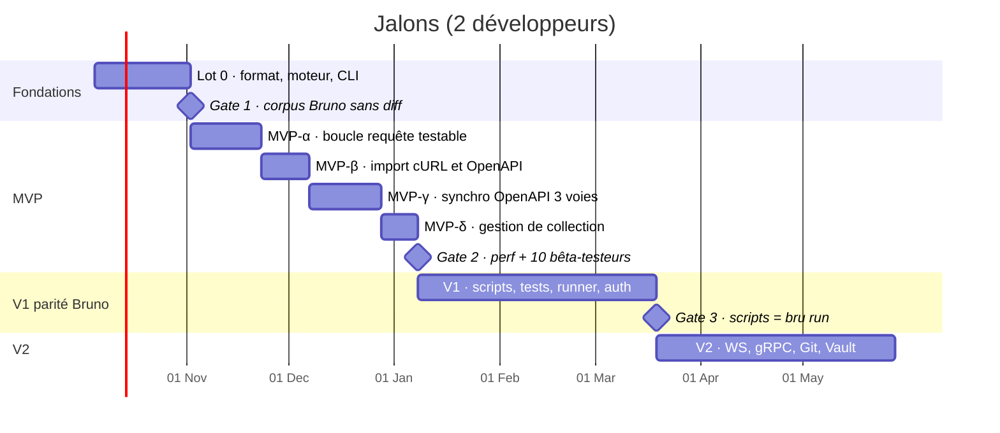

# Roadmap — Client API desktop offline-first

1er octobre 2026 · référence : `docs/cahier-des-charges.md`, maquette `design/maquette-v2/`

Cette roadmap découpe le cahier des charges en lots livrables, chacun fermé par une gate mesurable. Les dates supposent **deux développeurs à temps plein** (hypothèse non confirmée, voir § 9). Avec une seule personne, multiplier les durées par 1,8 environ.

## 0. Avancement au 1er octobre 2026 (MVP-α, β, γ et δ livrés)

| Élément | État | Où |
| --- | --- | --- |
| Maquette v2 (IDE, sombre d'abord) et `DESIGN.md` | Fait | `docs/design/maquette-v2/`, `DESIGN.md` |
| 0.1 Workspace Cargo (`core`, `engine`, `sync`, `cli`, `app`) | Fait ; `script` sera créé à son lot (YAGNI) | `Cargo.toml` |
| 0.2 CI build / fmt / clippy / tests sur 3 OS | Active et verte sur `github.com/issadicko/sira` (Linux, macOS, Windows) | `.github/workflows/ci.yml` |
| 0.3 Crate YAML | Décidé : parseur `yaml-rust2` + émetteur maison calqué sur celui de Bruno | `crates/core/src/yaml.rs` |
| 0.4 – 0.6 Modèle, format, variables | Fait (requête HTTP, dossiers, collection, environnements, `.env`, variables dynamiques) | `crates/core` |
| 0.7 Moteur HTTP avec timings et annulation | Fait (HTTP/1.1, TLS rustls + certificats du système) | `crates/engine` |
| 0.8 CLI `run` | Fait, plus `check` (aller-retour) et assertions déclaratives | `crates/cli` |
| 0.9 Corpus de 20 collections Bruno | Fait (Gate 1) : 27 collections publiques, 1 578 fichiers, épinglées par commit dans `manifest.json` et récupérées avec git (cache CI) ; relues et réécrites sans perdre de sens, de façon stable, sans toucher un fichier que personne n'a modifié, en ne changeant qu'une ligne pour une modification d'une ligne (nom, URL, méthode, ajout d'en-tête) ; a révélé un vrai bogue (modifier une requête GraphQL, gRPC ou WebSocket écrivait une table `http` en trop), corrigé | `crates/core/tests/corpus.rs`, `crates/core/tests/corpus/manifest.json` |
| 0.10 Bench de perf en CI | À faire | — |
| 0.11 Signature des binaires | À faire | — |
| MVP-α α.1 – α.8 | Fait (glisser-déposer livré au MVP-δ, édition des environnements à la ligne « Gestion d'environnements ») | `app/` |
| MVP-α α.9 Rechargement à chaud (`notify`) | Fait : lots de changements (200 ms de silence), onglets relus, onglet périmé quand un brouillon s'oppose, enregistrement qui demande confirmation avant d'écraser ; vérifié dans la fenêtre macOS avec Git et un éditeur extérieur | `crates/watch`, `app/src/app/core/store.ts`, `gestion-collection.md` § 10 |
| Gestion d'environnements (EF-VAR-01) | Fait : créer, renommer, dupliquer, supprimer (corbeille) et choisir l'environnement par défaut ; variables éditables (ajout, valeur, activation, suppression) enregistrées sans toucher aux autres clés du fichier (types, descriptions, `extends`, `color`) ; secrets jamais écrits ; brouillon comparé à ce que Rust a lu, avec le rechargement à chaud ; mode démo identique | `crates/core/src/collection/environment.rs`, `crates/sync/src/manage/environment.rs`, `app/src/app/core/env-store.ts`, `gestion-collection.md` § 11 |
| V1 Scripts : sandbox QuickJS, API `bru` / `req` / `res`, tests chai, assertions (EF-SCR-01 à 03, EF-TST-01, 02) | Fait, sauf `jwt`, `bru.cookies` et l'écriture des variables d'environnement sur disque : `xc-script` exécute une phase (variables, requête, réponse, chai, assertions déclaratives, `bru.runRequest`, `axios`, `bru.sendRequest`, bibliothèques, modules locaux), `xc-runner` enchaîne pré-requête, envoi, post-réponse, assertions et tests ; onglet Scripts éditable, résultats et console dans l'onglet Tests de la réponse | `crates/script`, `crates/runner`, `docs/docs/scripts.md` |
| V1 Runner et rapports CLI (EF-RUN-01, 02, EF-CLI-02) | Fait : `xc run` sur la collection, des dossiers ou des requêtes, `--delay`, `--bail`, `--data` CSV ou JSON (une itération par ligne), `bru.setNextRequest` et `bru.runner.*` ; rapports JSON (format de `bru run`), JUnit et HTML autonome, `--reporter-skip-*` ; image Docker (construite en CI) ; vue Runner de l'application (portée, options, résultats en direct, annulation, export) | `crates/runner/src/{run,data,report}.rs`, `crates/cli/src/run.rs`, `app/src-tauri/src/runs.rs`, `app/src/app/ui/runner-*.ts`, `Dockerfile`, `docs/docs/runner.md` |
| V1 Auth : Digest, AWS Signature V4, OAuth 2.0 (EF-AUT-01, 02) | Fait : Digest (RFC 7616) et AWS SigV4 vérifiés contre les vecteurs officiels ; OAuth 2.0 en client credentials, password, code d'autorisation + PKCE et implicite, rafraîchissement automatique, jeton en en-tête ou en paramètre, paramètres additionnels, variables `$oauth2.*` ; fenêtre de connexion et état du jeton dans l'onglet Auth | `crates/runner/src/{auth,oauth2}.rs`, `crates/engine/src/{aws,digest}.rs`, `crates/core/src/oauth2.rs`, `app/src-tauri/src/oauth.rs`, `app/src/app/ui/oauth2-editor.ts`, `docs/docs/auth.md` |
| V1 Secrets dans le trousseau (EF-VAR-03, ENF-SEC-01) | Fait pour l'application : la valeur d'une variable secrète se saisit dans le tableau d'environnement et vit dans le trousseau du système (Keychain, Gestionnaire d'identifiants, Secret Service), jamais dans le fichier ni dans l'interface (qui ne reçoit que « une valeur est gardée ») ; lue à l'envoi pour les requêtes, scripts et runner ; suit le renommage, la duplication et la suppression de l'environnement. À faire : lecture du trousseau par `xc run` (aujourd'hui `--env-var`), HashiCorp Vault en V2 | `crates/secrets`, `app/src-tauri/src/secrets.rs`, `crates/core/src/vars.rs`, `app/src/app/ui/env-table.ts`, `docs/docs/gestion-collection.md` |
| V1 Génération de code (EF-GEN-01) | Fait : cURL, JavaScript (`fetch`), Python (`requests`), Go, Java et Kotlin (OkHttp), Dart, PHP, C# ; requête résolue comme à l'envoi (secrets en repères `<nom>`), dialogue `</>`, `xc code` ; extraits exécutés contre un serveur local pour huit langages. À faire : GraphQL (avec EF-GQL-01) | `crates/codegen`, `crates/core/src/prepare.rs`, `app/src/app/ui/code-dialog.ts`, `docs/docs/generation-de-code.md` |
| V1 Imports : Postman, Insomnia, `.bru` (EF-IMP-01) | Postman v2.0 et v2.1 (collection et environnement) fait : dossiers, requêtes, corps, auth (dont OAuth 2 et Digest), variables, scripts traduits, exemples ; `xc import-postman`. Insomnia v4 (JSON) et v5 (YAML) fait : dossiers, requêtes, corps, auth (Basic, Bearer, Digest, API Key, AWS, OAuth 2), variables normalisées, environnements de base et sous-environnements ; `xc import-insomnia`. Collections `.bru` fait : `bruno.json`, `collection.bru`, `folder.bru`, requêtes (toutes les auths et tous les corps, variables typées, exemples enregistrés), environnements ; `xc import-bru`, la source n'est jamais modifiée. Dialogue « Importer depuis Postman / Insomnia / Bruno ». À faire : exports Postman, OpenAPI et cURL | `crates/sync/src/postman`, `crates/sync/src/insomnia`, `crates/sync/src/bru`, `crates/sync/src/import.rs`, `app/src/app/ui/import-dialog.ts`, `docs/docs/imports.md` |
| MVP-β β.1 Collage cURL et « Nouvelle requête depuis cURL… » | Fait ; analyse identique à Bruno (fixtures de son code et 113 000 commandes aléatoires) | `crates/sync/src/curl`, `app/src/app/ui/url-bar.ts` |
| MVP-β β.2 Import OpenAPI 3.0 / 3.1 / Swagger 2.0 (fichier ou URL), tags ou chemins | Fait ; collection identique à l'octet à celle de Bruno (35 specs × 2 regroupements, 34 arbres d'import) | `crates/sync/src/openapi`, `crates/sync/src/import`, `xc import` |
| MVP-β β.3 Base `.oc-sync/openapi/` | Fait : `source.yml` (source, regroupement, opérations) et copie brute de la spec, écrits en dernier (format revu au MVP-γ, `synchro-openapi.md` § 2) | `crates/sync/src/store.rs` |
| MVP-δ δ.1 – δ.6 Gestion de collection (créer, renommer, dupliquer, supprimer, déplacer) | Fait : fichiers créés identiques à Bruno, modifications limitées à `info.name` / `info.seq`, corbeille du système, renommage sans écrasement, `source.yml` suivi ; arbre au clavier, glisser-déposer, « Déplacer vers… » | `crates/sync/src/manage`, `app/src/app/core/tree-store.ts`, `gestion-collection.md` |
| MVP-γ γ.1 – γ.8 Synchro OpenAPI à 3 voies | Fait : fusion champ par champ, connexion sans base, rapprochements, écran de fusion, `xc sync --check / --apply` ; 500 opérations en 1,21 s (ENF-PERF-07) | `crates/sync/src/{merge,sync}`, `app/src/app/ui/merge-editor.ts` |
| MVP-β β.4 Palette ⌘K | Fait : requêtes, commandes (registre partagé avec les raccourcis), environnements | `app/src/app/ui/palette.ts` |
| MVP-β β.5 CodeMirror 6 | Fait ; réponse JSON de 10 Mo affichée en 140 ms (Chrome, mode démo), formatage en Rust | `app/src/app/ui/code-editor.ts`, `crates/core/src/pretty.rs` |
| Corps form-urlencoded et multipart (EF-REQ-02) | Fait : lecture, écriture, envoi et édition | `crates/core`, `app/src/app/ui/multipart-table.ts` |
| Build de production de la fenêtre | Corrigé : Angular émettait la feuille de style avec un `onload` que la CSP de la fenêtre interdit, l'application empaquetée s'affichait sans style (invisible en mode dev) ; `inlineCritical` désactivé dans `angular.json` | `app/angular.json` |
| Réglages d'apparence (EF-UX-03) | Fait : écran « Réglages » (barre d'activité, palette, ⌘,), thème puis famille et taille des polices de l'interface, de l'éditeur de requête et du résultat, appliquées en direct et enregistrées dans `localStorage` (`xc-settings`) ; tailles de l'interface relatives à la taille choisie | `app/src/app/core/settings.ts`, `app/src/app/ui/settings-view.ts`, `app/src/app/ui/appearance-settings.ts` |

Écarts assumés du MVP-α : secrets d'environnement non saisissables, ni créables (trousseau en V1, `{{process.env.X}}` fonctionne déjà), scripts conservés mais non exécutés, corps `file` (binaire) et `sparql` conservés mais non envoyés, HTTP/2 non négocié, redirections non suivies à l'envoi.

Écarts volontaires avec Bruno au MVP-β (principe « non destructif ») : à l'import, deux requêtes dont les noms de fichier se confondent reçoivent un suffixe au lieu de s'écraser ; « Nouvelle requête depuis cURL » refuse d'écraser un fichier existant ; le collage cURL recopie aussi les champs de formulaire (Bruno ne change que le mode) ; `.oc-sync` est ajouté à la liste `ignore` de `opencollection.yml`. Les mesures de ENF-PERF-04 restent à refaire dans la WebView de Tauri (coût IPC compris).

## 1. Vue d'ensemble

| Jalon | Fin estimée | Ce qu'on peut montrer |
| --- | --- | --- |
| Lot 0 | 30 oct. 2026 | `cli run` exécute une requête Bruno réelle, timings DNS/TCP/TLS/TTFB, aller-retour YAML sans diff |
| MVP-α | 20 nov. 2026 | L'app ouvre une collection Bruno, édite, envoie, affiche la réponse et la timeline, enregistre sans diff |
| MVP-β | 4 déc. 2026 | Coller un cURL crée une requête ; importer une spec OpenAPI crée une collection |
| MVP-γ | 25 déc. 2026 | Resynchroniser une spec modifiée, arbitrer les conflits champ par champ |
| MVP-δ (MVP complet) | 5 janv. 2027 | Partir d'un dossier vide : créer la collection, ses dossiers et ses requêtes, les renommer, dupliquer, déplacer et supprimer comme dans Bruno |
| V1 | 16 mars 2027 | Parité Bruno sur scripts, tests, runner, OAuth 2.0, GraphQL, CLI avec rapports |
| V2 | 25 mai 2027 | WebSocket, gRPC, Git intégré, Vault, NTLM, docs |

## 2. Définition du MVP testable (MVP-α)

Le MVP-α est le plus petit produit qu'un développeur peut utiliser une journée entière sur une vraie collection Bruno. Tout le reste attend.

**Dedans**

- Ouvrir un dossier de collection OpenCollection YAML existant (créé par Bruno) et l'afficher en arbre : dossiers, requêtes, ordre `seq`.
- Onglets de requêtes, indicateur « non enregistré », `Ctrl/⌘+S` qui écrit le fichier sans diff parasite.
- Éditer méthode, URL, paramètres query (synchronisés avec l'URL), en-têtes, corps JSON/texte.
- Environnements de la collection : sélection de l'environnement actif, résolution `{{var}}` (runtime > requête > dossier > environnement > collection), variables dynamiques `{{$uuid}}`, `{{$timestamp}}`, `{{$randomInt}}`.
- Envoi HTTP/1.1 et HTTPS avec annulation, réponse (statut, durée, taille, en-têtes, corps JSON formaté) et timeline DNS / TCP / TLS / TTFB / téléchargement.
- CLI `run` sur une requête ou un dossier, `--env`, code de sortie non nul si une assertion `res.status` échoue ou si le réseau échoue.
- Thèmes sombre et clair de la maquette v2.

**Dehors (lots suivants)**

Synchro OpenAPI, imports, scripts JavaScript, auth autre que Bearer/Basic hérités, Git intégré, palette de commandes complète, CodeMirror (le MVP-α utilise un éditeur texte simple et une vue JSON en lecture seule), HTTP/2, proxy, mTLS.

**Critères d'acceptation du MVP-α**

1. Une collection Bruno publique (corpus Gate 1) s'ouvre, chaque requête s'envoie, et un enregistrement sans modification ne change aucun octet.
2. `cargo test --workspace` passe ; chaque exigence couverte a un test qui porte son identifiant.
3. Démarrage à froid < 1 s et ouverture d'une collection de 1 000 requêtes < 500 ms sur la machine de référence (mesures indicatives, CI de perf au Lot 0).
4. Aucun appel réseau sortant au démarrage.

## 3. Lot 0 — Fondations (4 semaines)

| # | Tâche | Exigences | Livrable | Critère de fin |
| --- | --- | --- | --- | --- |
| 0.1 | Workspace Cargo `core`, `engine`, `sync`, `cli`, `app` ; `script` créé vide | — | `Cargo.toml` racine | `cargo build` vert sur les 3 OS |
| 0.2 | CI GitHub Actions : build, test, clippy `-D warnings`, fmt, matrice Windows / macOS / Linux | ENF-COMP-01 | `.github/workflows/ci.yml` | Pipeline vert |
| 0.3 | Choix de la crate YAML maintenue (`serde_yml` vs `serde_norway` vs écriture maison) avec bench d'aller-retour | ENF-COMP-02 | ADR `docs/adr/0001-yaml.md` | Décision écrite et justifiée |
| 0.4 | `core::model` : Collection, Folder, Request, Environment, Variable | EF-REQ-01 | types Rust | Tests unitaires |
| 0.5 | `core::format` lecture et écriture OpenCollection YAML, ordre des clés stable, champs inconnus conservés | ENF-COMP-02 | `read_collection`, `write_request` | Test `enf_comp_02_round_trip` sur le corpus |
| 0.6 | `core::vars` résolution `{{var}}`, précédence Bruno, variables dynamiques | EF-VAR-01, EF-VAR-02 | `Resolver` | Tests par niveau de précédence |
| 0.7 | `engine` envoi HTTP avec timings bas niveau (hyper + rustls), annulation | EF-RES-01, EF-RES-02, EF-REQ-03 | `send(&PreparedRequest)` | Test sur serveur local, timings cohérents |
| 0.8 | `cli run` minimal | EF-CLI-01 | binaire `cli` | Code de sortie testé |
| 0.9 | Corpus de 20 collections Bruno publiques en sous-module de test | ENF-COMP-02 | `tests/corpus/` | Gate 1 |
| 0.10 | Bench de perf en CI (criterion) avec seuil de régression 10 % | ENF-PERF-03, 05, 06 | `benches/` | Rapport publié par la CI |
| 0.11 | Pipeline de signature (macOS notarisation, Windows, Linux) | ENF-SEC-04 | workflow `release.yml` | Un binaire signé produit |

**Gate 1** : le corpus est relu puis réécrit sans aucun diff. Sans elle, le MVP ne démarre pas.

Franchie le 5 octobre 2026. « Sans aucun diff » se tient là où il compte : un fichier que personne n'a modifié n'est jamais réécrit (même écrit à la main ou par un autre outil), et un fichier tel que Bruno l'écrit change sur la seule ligne éditée. Pour le reste, la réécriture suit l'émetteur de Bruno et ne perd rien : sur les 1 578 fichiers, 1 247 reviennent à l'octet près ; les 331 autres (14 collections) sont écrits autrement — chaînes entre apostrophes ou guillemets superflus, lignes vides absentes ou en trop, listes au niveau de leur clé — et `manifest.json` donne leur nombre exact et leur cause (le test échoue si le nombre bouge, dans un sens comme dans l'autre). Bruno réécrit lui aussi le fichier entier à l'enregistrement.

## 4. MVP (9,5 semaines)

### MVP-α — boucle requête (3 semaines)

| # | Tâche | Exigences |
| --- | --- | --- |
| α.1 | Coque Tauri 2 + Angular zoneless (signals), tokens de la maquette v2, thèmes clair/sombre | EF-UX-01 |
| α.2 | Commandes IPC typées : `open_collection`, `read_request`, `save_request`, `send_request`, `cancel_request`, `list_environments` | — |
| α.3 | Barre d'activité, îlot Collections (arbre, filtre), barre d'état | EF-COL-01 (sans glisser-déposer) |
| α.4 | Onglets, fil d'Ariane du fichier, indicateur non enregistré, `Ctrl/⌘+S` | EF-REQ-03 |
| α.5 | Barre d'URL avec méthode colorée et pastilles `{{var}}` survolables (valeur et niveau) | EF-REQ-01, EF-VAR-01 |
| α.6 | Paramètres query/path en tableau synchronisés avec l'URL, en-têtes, corps JSON/texte | EF-REQ-01, EF-REQ-02 (partiel) |
| α.7 | Sélecteur d'environnement, coup d'œil des valeurs | EF-VAR-01 |
| α.8 | Réponse : statut, durée, taille, en-têtes, corps JSON formaté, timeline, annulation | EF-RES-01, EF-RES-02 |
| α.9 | Rechargement à chaud quand un fichier change sur disque (`notify`) | EF-COL-03 |

### MVP-β — imports (2 semaines)

| # | Tâche | Exigences |
| --- | --- | --- |
| β.1 | Collage d'une commande cURL détecté dans la barre d'URL | EF-IMP-01 (cURL) |
| β.2 | Import OpenAPI 3.0 / 3.1 / Swagger 2.0 (fichier ou URL) vers une collection, dossiers par tag | EF-IMP-02 |
| β.3 | Base `.oc-sync/openapi/` (copie brute de la spec) écrite à l'import | EF-SYN-06 |
| β.4 | Palette de commandes (`Ctrl/⌘+K`) : requêtes, commandes, environnements | EF-UX-01 |
| β.5 | CodeMirror 6 pour le corps de requête et la réponse (gros documents, pliage, recherche) | ENF-PERF-04 |

### MVP-γ — synchro OpenAPI non destructive (3 semaines)

| # | Tâche | Exigences |
| --- | --- | --- |
| γ.1 | `sync::merge` : fusion à 3 voies champ par champ, clé `operationId` ou méthode + chemin normalisé | EF-SYN-01, EF-SYN-04 |
| γ.2 | Table de propriété des champs (spec / équipe), valeurs saisies conservées | EF-SYN-04 |
| γ.3 | Opérations nouvelles rangées par tag, opérations retirées marquées dépréciées | EF-SYN-02, EF-SYN-03 |
| γ.4 | Rapprochement manuel quand le chemin change sans `operationId` | EF-SYN-01 |
| γ.5 | Écran de fusion de la maquette v2 : Équipe / Spec / Résultat, base optionnelle, actions par conflit | EF-SYN-04 |
| γ.6 | Aperçu avant écriture, base réécrite en dernier, synchro interrompue rejouable | EF-SYN-05, EF-SYN-06 |
| γ.7 | `cli sync --check` | EF-SYN-07 |
| γ.8 | Tests des quatre issues de fusion (aucun changement, spec seule, équipe seule, conflit) | Critères § 9 |

### MVP-δ — gestion de collection (1,5 semaine)

Ajouté le 1er octobre 2026 : sans ce lot, on ne peut pas partir de zéro (ouvrir un dossier vide échoue, seule la création depuis cURL existe), ce qui bloque la Gate 2. Tout ce qui est écrit doit être identique à ce qu'écrit Bruno, vérifié par l'oracle `tools/oracle`.

| # | Tâche | Exigences |
| --- | --- | --- |
| δ.1 | Ouvrir un dossier vide propose « Créer une collection ici » (nom, puis `opencollection.yml` comme Bruno) ; « Nouvelle collection… » depuis l'accueil et la palette | EF-COL-04 |
| δ.2 | Nouvelle requête HTTP vierge et nouveau dossier (`folder.yml`) depuis l'arbre (bouton +, menu contextuel) et la palette, `seq` suivant | EF-COL-04 |
| δ.3 | Renommer une requête ou un dossier (nom affiché et fichier), dupliquer (clonage) | EF-COL-01, EF-COL-04 |
| δ.4 | Supprimer une requête ou un dossier vers la corbeille du système, après confirmation, jamais de suppression définitive | EF-COL-04 |
| δ.5 | Glisser-déposer dans l'arbre : réordonner (réécriture des `seq` comme Bruno) et déplacer entre dossiers | EF-COL-01 |
| δ.6 | Synchro OpenAPI : un fichier renommé ou déplacé par ces actions reste suivi (mise à jour de `.oc-sync/openapi/source.yml`) | EF-SYN-01 |

**Gate 2** : budgets de perf ENF-PERF-01 à 08 tenus sur les trois OS, 10 bêta-testeurs actifs pendant deux semaines.

## 5. V1 — parité Bruno (10 semaines)

| Semaines | Thème | Exigences |
| --- | --- | --- |
| 1-3 | Sandbox QuickJS (`rquickjs`), API `bru` / `req` / `res`, scripts pré et post aux trois niveaux | EF-SCR-01, 02, 03, ENF-SEC-02 |
| 3-4 | Tests Chai, assertions déclaratives, onglet Tests de la réponse | EF-TST-01, 02 |
| 4-5 | Runner : collection ou dossier, délai, arrêt au premier échec, itérations CSV/JSON | EF-RUN-01, 02 |
| 5-6 | CLI : rapports JUnit, HTML, JSON ; image Docker | EF-CLI-02 |
| 6-7 | Auth : OAuth 2.0 (code + PKCE, client credentials, password, refresh), Digest, AWS SigV4, API Key ; secrets dans le trousseau | EF-AUT-01, 02, 04, EF-VAR-03 |
| 7-8 | Imports Postman v2.1, Insomnia, lecture et conversion `.bru` ; exports Postman, OpenAPI, cURL | EF-IMP-01, 03 |
| 8-9 | GraphQL : requêtes, variables, introspection, autocomplétion | EF-GQL-01 |
| 9-10 | Génération de code (9 langages), historique local, gestionnaire de cookies, réglages réseau (timeout, proxy, mTLS, CA) | EF-GEN-01, EF-UX-02, EF-REQ-04 |

**Gate 3** : les scripts et tests du corpus donnent les mêmes résultats que `bru run` (ENF-COMP-03).

## 6. V2 — protocoles et fonctions avancées (10 semaines)

WebSocket (EF-WS-01), gRPC unaire et streaming via `.proto` ou réflexion (EF-GRPC-01), Git intégré avec la vue Source Control de la maquette (EF-GIT-01, via `gix`), HashiCorp Vault (EF-VAR-03), NTLM et OAuth 1.0 (EF-AUT-03), docs Markdown de collection (EF-DOC-01), interface anglaise complète (EF-UX-01).

## 7. V3 — candidats

Assistant IA optionnel avec clé de l'utilisateur (EF-AI-01), mock server, monitoring planifié. Chacun passe d'abord par une décision écrite au regard des cinq principes du cahier des charges.

## 8. Qualité transverse, à chaque lot

- Chaque exigence implémentée a au moins un test nommé d'après son identifiant (`ef_req_01_…`).
- Couverture > 80 % sur `core` et `sync` (ENF-QUAL-01), mesurée par `cargo llvm-cov`.
- Aucune télémétrie, aucun appel sortant non demandé (ENF-SEC-03) : test d'intégration qui démarre l'app sans réseau.
- Revue de design contre `design/maquette-v2/` et `DESIGN.md` avant chaque fusion touchant l'interface.

## 9. Risques et décisions ouvertes

| Sujet | Impact | Action | Échéance |
| --- | --- | --- | --- |
| Taille de l'équipe non confirmée | Planning ×1,8 à une personne | Confirmer avant le 5 oct. | Lot 0 |
| Spec OpenCollection encore jeune, champs qui bougent | Fichiers réécrits de façon incompatible | Champs inconnus conservés tels quels, corpus mis à jour à chaque release Bruno | Continu |
| Crate YAML (`serde_yaml` archivé) | Aller-retour sans diff impossible si le sérialiseur reformate | Bench au Lot 0 ; repli : écrivain YAML maison pour le sous-ensemble OpenCollection | Lot 0 |
| Timings bas niveau avec HTTP/2 | Timeline incomplète en HTTP/2 | HTTP/1.1 au MVP, HTTP/2 via ALPN en V1 | V1 |
| WebKitGTK plus lent sous Linux | UI moins fluide | Traitements lourds en Rust, listes virtualisées, mesures aussi sous Linux | MVP |
| Fusion OpenAPI déjà présente chez Bruno ? | Différenciant affaibli | Vérifié (étude `etude-synchro-openapi-bruno.md`) : Bruno a une synchro OpenAPI en bêta, désactivée par défaut, à deux diffs et par endpoint entier, base hors dépôt, ajouts de l'équipe et opérations retirées supprimés. Communiquer sur la fusion à 3 voies champ par champ, la base versionnée et le non-destructif. Choix tranchés le 1er oct. : pas d'entrée `extensions.bruno.openapi`, base = copie brute de la spec, `.oc-sync/` versionné | MVP-γ |
| Nom du produit | Binaire, bundle id, domaine | Décision avant la première release signée | Gate 2 |
